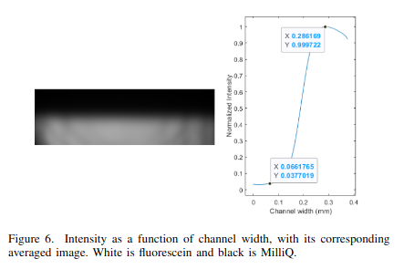
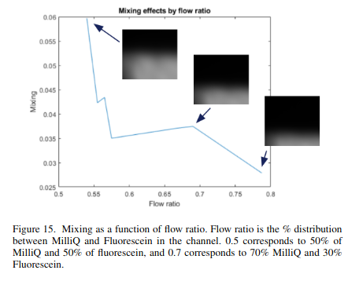
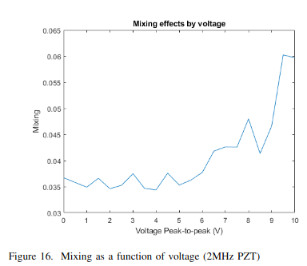

# Thermoacoustic Mixing Analysis

MATLAB code for analyzing fluorescence images from microfluidic thermoacoustic mixing experiments. Developed together with my thesis partner during our bachelor's thesis, the tool processes TIFF stacks exported from ImageJ to compare intensity profiles, investigate experimental parameters, and support resonance-frequency analysis in a microchip.

## Features

- Calculate intensity profiles averaged across image columns and TIFF frames.
- Subtract an optional background profile and normalize profiles to their maximum value.
- Display averaged images, intensity profiles, and summary statistics.
- Plot mean intensity per frame to inspect flow stabilization.
- Compare inlet and outlet fluorescence intensities across temperatures in rhodamine experiments.
- Organize parameter-study measurements and explore profile standard deviations in 2D and 3D plots.

## Example outputs







## Requirements

- MATLAB. A minimum supported release has not been established; the code uses string arrays, implicit expansion, `height`, `width`, and `mean(..., "all")`.
- Image Processing Toolbox for `imshow`.
- Statistics and Machine Learning Toolbox for the existing `nanmean` calls.
- Grayscale TIFF stacks, for example exported from ImageJ. Experimental data is not included.

The scripts were written for Windows and contain backslash-based path handling. Some helpers require adaptation for Linux or macOS.

## Repository contents

| File | Purpose |
| --- | --- |
| [`ALLfuncs.m`](ALLfuncs.m) | Static methods for TIFF processing, intensity plots, data organization, and parameter-study plots. |
| [`RHDfuncs.m`](RHDfuncs.m) | Static methods for importing rhodamine measurement directories and plotting inlet/outlet intensity differences. |
| [`main.m`](main.m) | Exploratory MATLAB script sections used during the experiments, with local data paths. |

## Data layout

Pass a **directory path**, rather than a TIFF file path, to the intensity methods. Each directory should contain a grayscale `.tif` file with one or more frames. If multiple `.tif` files exist, the code selects the most recently modified one. The current `*.tif` search does not select files ending in `.tiff`.

```text
experiments/
├── input/
│   └── 25_1/
│       ├── measurement.tif
│       └── background_1/
│           └── background.tif
└── output/
    └── 25_1/
        ├── measurement.tif
        └── background_1/
            └── background.tif
```

For rhodamine analyses, names such as `25_1` encode temperature before the underscore. Input and output directories must contain corresponding measurements in the same directory-listing order: `importData` pairs them by position, rather than matching names. `plotTemperatureLoss` expects a `background_1` subdirectory for every measurement. Use background images with dimensions matching the measurement images.

## Quick start

Clone or download the repository, open MATLAB, and set its current folder to the repository directory so the classes are available. Replace the example paths with your own absolute Windows paths.

### Plot an intensity profile

```matlab
measurementDir = "C:\experiments\input\25_1";

% An empty string skips background subtraction.
values = ALLfuncs.calcIntensity(measurementDir, "");
ALLfuncs.plotIntensity(values, measurementDir, "");

% Alternatively, subtract a background profile.
backgroundDir = measurementDir + "\background_1";
correctedValues = ALLfuncs.calcIntensity(measurementDir, backgroundDir);
ALLfuncs.plotIntensity(correctedValues, measurementDir, backgroundDir);
```

Use the same measurement and background paths for calculation and plotting so the displayed image corresponds to the profile.

### Normalize a profile or inspect individual frames

```matlab
normalizedValues = ALLfuncs.calcNormalizedIntensity(measurementDir);
ALLfuncs.plotIntensity(normalizedValues, measurementDir, "");

ALLfuncs.plotIntensityOneTIF(measurementDir);
```

Normalization divides the profile by its maximum and does not subtract a background. The frame-intensity plot averages all pixels in each frame without thresholding. Its horizontal axis is labeled time, but represents frame index; acquisition timing is not read from the TIFF.

### Compare inlet and outlet intensities

```matlab
inputDir = "C:\experiments\input";
outputDir = "C:\experiments\output";

data = RHDfuncs.importData(inputDir, outputDir);
RHDfuncs.plotTemperatureLoss(data);
```

`data` is a three-column string array containing input paths, output paths, and temperatures parsed from output directory names. Despite its name, `plotTemperatureLoss` plots **mean outlet intensity minus mean inlet intensity** against temperature; it does not convert intensity differences into temperature loss.

To use `main.m`, replace its hardcoded paths and run the individual sections relevant to your experiment. Running the entire script requires experiment-specific variables and data.

## Processing details and limitations

`calcIntensity` converts each frame to `double`, excludes values below the fixed threshold of **200** using `NaN`, calculates a mean across columns for each row, and averages those row profiles across frames. When a background is supplied, it calculates a thresholded mean background profile and subtracts it from each measurement frame before applying the measurement threshold. Profile positions are image-row indices; no physical distance calibration is applied.

`plotIntensity` displays an averaged image, the supplied profile, standard deviation, mean, and a `Peakestimate`. This estimate counts profile entries at or above `0.5`. For a normalized profile, it is a count above half maximum, rather than an interpolated full width at half maximum. Image display uses pixelwise background subtraction, whereas profile calculation subtracts a row-mean background.

Rows with no pixels above the threshold can produce `NaN` values. The existing `values(values == NaN) = []` statement does not remove them, and normalization has no explicit protection against a zero maximum. Inspect profiles before interpreting statistics or comparing experiments.

The parameter-study helpers (`formatData`, `findDataPaths`, `calcMatrix`, `plot2Ddata`, `plot3Ddata`, `showAllData`, and `findSpecificData`) follow the original experiment's `data/` directory and `parameterinfo.txt` conventions. `formatData` renames and moves measurement directories from `unformatted data/`. These helpers need adaptation to a new experiment; `plot4Ddata` is explicitly marked nonworking in the source.

## Related thesis

The associated bachelor's thesis is available through [Lund University's student publications repository](https://lup.lub.lu.se/student-papers/record/9158577).
